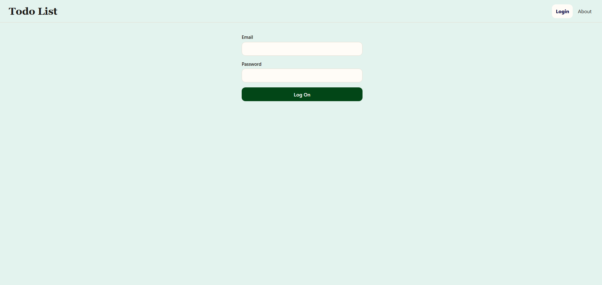
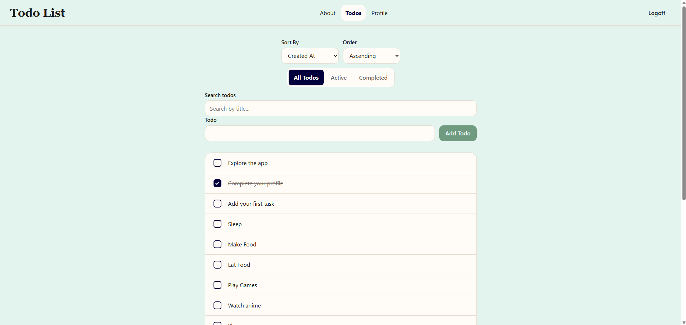
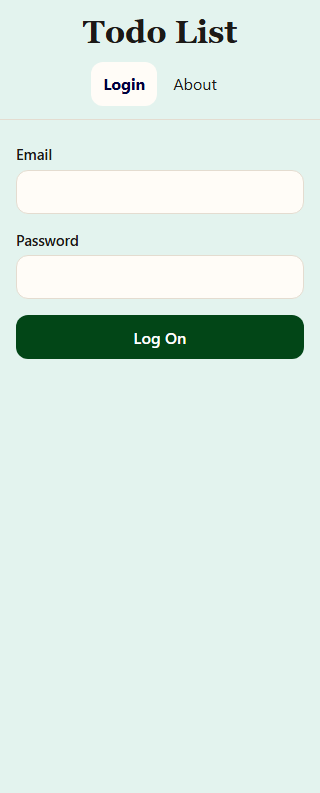
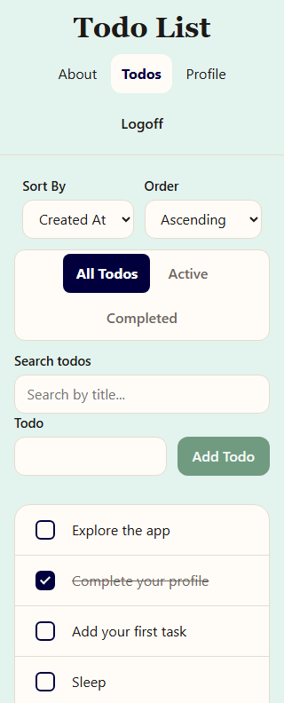

# 📝ToDo List📝

This is a ToDo web application that allows users to save and view a list of tasks under their account after logging in. Users are able to add todo, mark as completed, edit, filter or search their todos and also see their todo statistics under their profile section. Todos and login are stored through the REST API provided in the Code The Dream React course. Vite proxies /api to that server using VITE_TARGET in a local .env file.

## ✨Features✨

- Log in / log off with protected routes
- Add, complete, and edit todos
- Filter All / Active / Completed (URL query)
- Sort by created date or title
- Search by title
- Profile with todo statistics
- Responsive layout

## 🛠️Technologies Used🛠️

- React.js
- React Router
- Vite
- Styled-components

## 📸Screenshots📸

### Desktop

### Mobile

## 💻Getting Started💻

### Prerequisites
- Node.js (LTS)
- npm

### Installation
1. Clone or download the project
2. Change directory to todo-list (`cd todo-list`)
3. Create a .env with VITE_TARGET= (the URL from the CTD instructions)
4. Run `npm install`
5. Run `npm run dev`
6. Open the URL Vite provides

## 📜Available Scripts📜

- `npm run dev` - Starts/launch the local development server
- `npm run build` - Production build into dist/
- `npm run preview` - Serve that build locally
- `npm run lint` - ESLint check

## 🎨Design Decisions🎨

I chose to use styled-components because it was a different styling method that I wanted to learn which seemed like the next step after CSS Modules. It supports CSS in Javascript with component-scoped styles and dynamic theming and also eliminates unused CSS which was why I chose to learn and implement this option. I used a theme object (primary / accent / etc.) and props like $variant and $completed so styles stay consistent.

## ⌛Future Improvements⌛
- Adding option to delete todos
- Adding dark mode
- Deploying

## 📄License📄
This project is licensed under the MIT License. See [LICENSE](LICENSE) for details.

## ✉️Contact✉️
GitHub: [Courressa](https://github.com/Courressa)
Portfolio: [Courressa](https://courressa.com)
